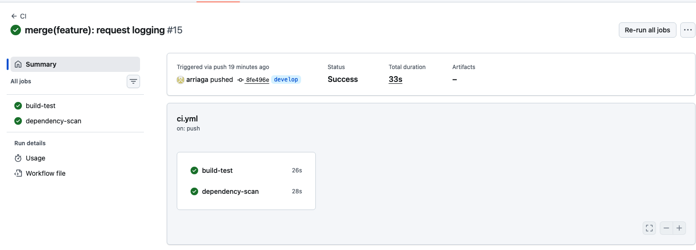
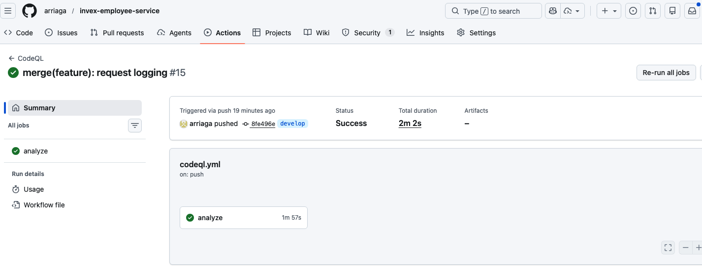
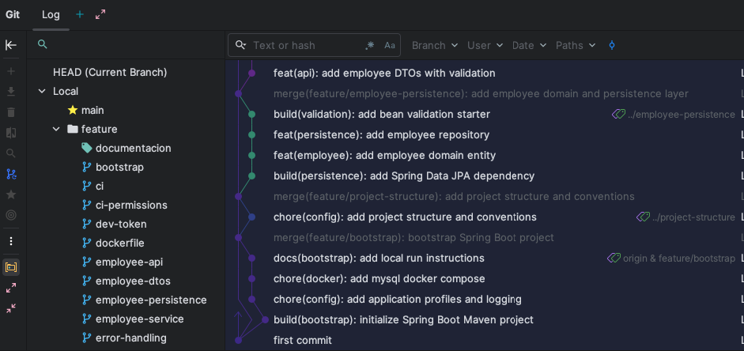
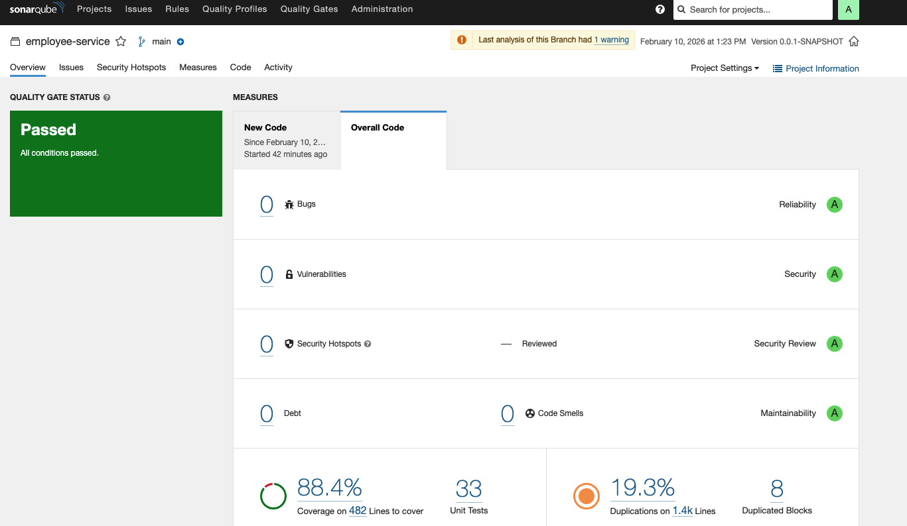
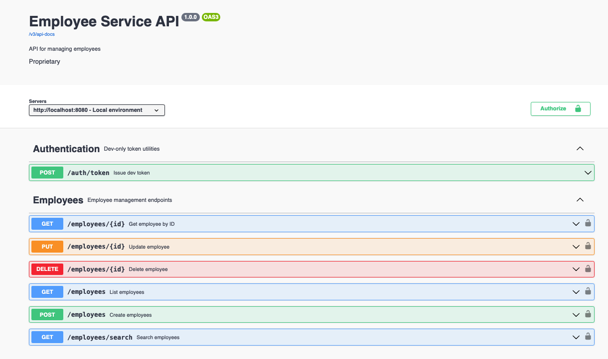
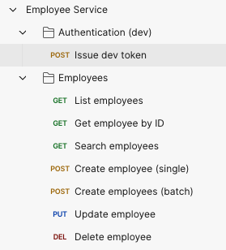

# Employee Service

Servicio REST para gestionar empleados, con JWT como Resource Server y migraciones automáticas con Flyway.

## Requisitos

- Java 17
- Maven 3.8+
- Docker (para MySQL/Sonar local)

## Instalacion rapida

### 1) Levantar MySQL local
```bash
docker compose up -d
```

### 2) Ejecutar la aplicacion (perfil dev)
```bash
mvn spring-boot:run -Dspring-boot.run.profiles=dev
```

### 3) Verificar salud
```bash
curl http://localhost:8080/actuator/health
```

## Configuracion

Variables comunes (valores por defecto en `application.yml`):

- `SPRING_DATASOURCE_URL`
- `SPRING_DATASOURCE_USERNAME`
- `SPRING_DATASOURCE_PASSWORD`
- `JWT_SECRET` (minimo 32 bytes para HS256)
- `SERVER_PORT` (por defecto 8080)

Perfiles:

- `dev`: habilita el endpoint de token local.
- `default`: pensado para entornos no locales.

## Ejecucion

### Ejecutar en modo desarrollo
```bash
mvn spring-boot:run -Dspring-boot.run.profiles=dev
```

### Construir el JAR
```bash
mvn clean package
```

### Construir imagen Docker
```bash
docker build -t employee-service:local .
```

## Migraciones

Flyway se ejecuta en el arranque y aplica los scripts en `src/main/resources/db/migration`.

## Pruebas

```bash
mvn test
```

Cobertura local:

- Reporte HTML: `target/site/jacoco/index.html`

## API y Swagger

Swagger UI:

```bash
http://localhost:8080/swagger-ui/index.html
```

OpenAPI JSON:

```bash
http://localhost:8080/v3/api-docs
```

## Seguridad

El servicio usa JWT Bearer tokens.

Endpoints publicos:

- GET `/actuator/health`
- GET `/v3/api-docs/**`
- GET `/swagger-ui/**`

Endpoints protegidos:

- GET `/employees`, GET `/employees/{id}`, GET `/employees/search` requieren `SCOPE_employee.read`
- POST `/employees`, PUT `/employees/{id}`, DELETE `/employees/{id}` requieren `SCOPE_employee.write`

### Token local (solo perfil dev)

```bash
curl -X POST http://localhost:8080/auth/token \
  -H "Content-Type: application/json" \
  -d '{"subject":"local-user","scopes":["employee.read","employee.write"],"expiresInMinutes":60}'
```

### Ejemplo de uso con token

```bash
TOKEN="<jwt>"
curl -H "Authorization: Bearer $TOKEN" http://localhost:8080/employees
```

### Coleccion Postman

Archivos en el repo:

- `postman/employee-service.postman_collection.json`
- `postman/employee-service.postman_environment.json`

Importa ambos en Postman y ajusta la variable `baseUrl` segun tu entorno.

### Curls de operaciones

```bash
BASE_URL="http://localhost:8080"
TOKEN="<jwt>"

# Listar empleados
curl -H "Authorization: Bearer $TOKEN" "$BASE_URL/employees"

# Obtener empleado por id
curl -H "Authorization: Bearer $TOKEN" "$BASE_URL/employees/1"

# Buscar empleados por nombre
curl -H "Authorization: Bearer $TOKEN" "$BASE_URL/employees/search?name=ana"

# Crear empleado (single)
curl -X POST "$BASE_URL/employees" \
  -H "Authorization: Bearer $TOKEN" \
  -H "Content-Type: application/json" \
  -d '{"firstName":"Ana","lastName":"Ruiz","age":30,"sex":"F","birthDate":"1994-02-10","position":"Engineer","active":true}'

# Crear empleados (batch)
curl -X POST "$BASE_URL/employees" \
  -H "Authorization: Bearer $TOKEN" \
  -H "Content-Type: application/json" \
  -d '[
    {"firstName":"Ana","lastName":"Ruiz","age":30,"sex":"F","birthDate":"1994-02-10","position":"Engineer","active":true},
    {"firstName":"Luis","lastName":"Diaz","age":28,"sex":"M","birthDate":"1996-01-15","position":"Analyst","active":true}
  ]'

# Actualizar empleado
curl -X PUT "$BASE_URL/employees/1" \
  -H "Authorization: Bearer $TOKEN" \
  -H "Content-Type: application/json" \
  -d '{"position":"Senior Engineer","active":true}'

# Eliminar empleado
curl -X DELETE "$BASE_URL/employees/1" \
  -H "Authorization: Bearer $TOKEN"
```

## DevSecOps

### GitHub Actions

- CI: compila el proyecto, ejecuta pruebas y analiza dependencias.
- CodeQL: ejecuta analisis SAST semanal y en PRs para detectar vulnerabilidades.

### Evidencias de pipelines




## Evidencias

### Gitflow



### SonarQube



### OpenAPI



### Postman


